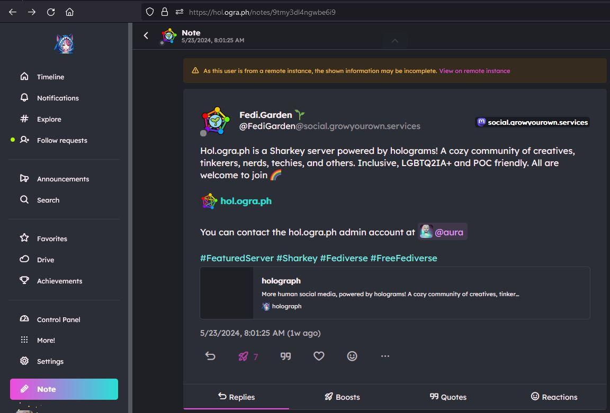
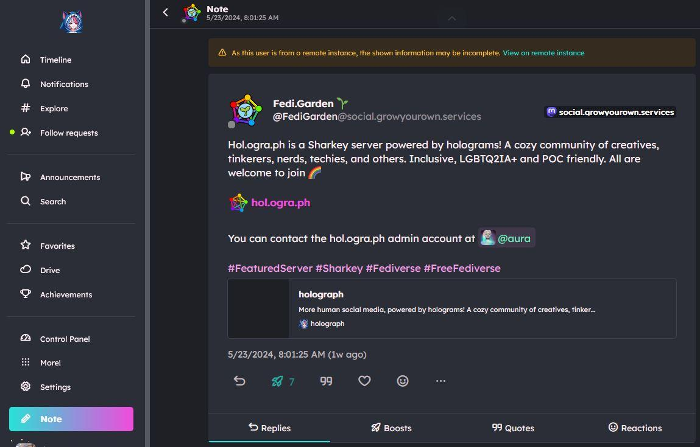
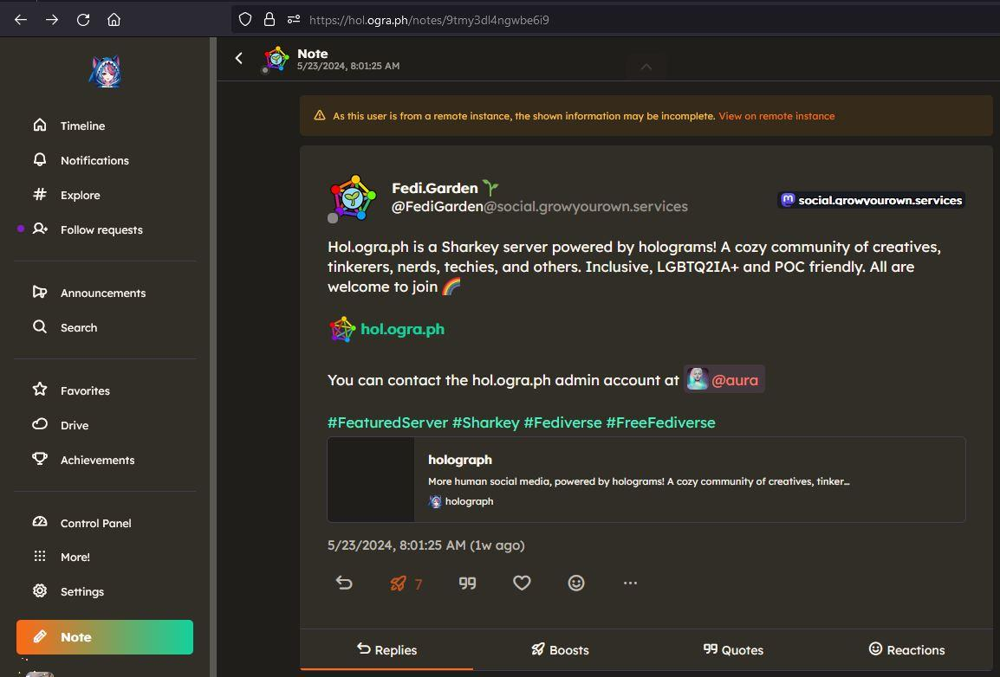
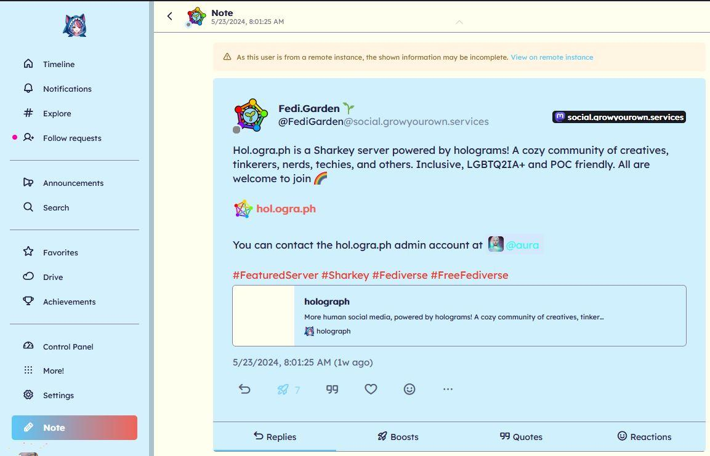

# Misskey Themes by hol.ogra.ph

)

This is a collection of custom themes for Misskey (as well as its forks, such as Sharkey) created by the [hol.ogra.ph](https://hol.ogra.ph) community. 

## How to Use

On Misskey (and its forks), with a simple client-side JSON configuration, you can change the colors, fonts, etc of your interface. 

Simply navigate to `Settings` -> `Themes` -> `Install a Theme` while logged into your Misskey instance. Then, copy and paste the contents of the desired theme file into the provided text box. Then click "Install". That's it! 

If you want to preview a theme before committing to installing it, you can instead go to the `Make a Theme` section and paste the theme contents there. This way, you can clear/reset the theme back to normal with a simple browser refresh. 

## Theme List

### Holo-Yang (Dark)

Currently the default Holograph theme. Vaporwave vibes, with an emphasis on fuchsia. 

### Holo-Yin (Dark)

Alternate version of the default Holo-Yang holograph theme. Swaps cyan and fuchsia, for a different feel. 

### Holoween (Dark)

WIP - a mysterious orange and teal theme, ideal for a witchy feel or just for evening browsing. 

### Holo Girl Summer (Light)

WIP - my first attempt at a light theme. Pastel blues and yellows. Not sure what I'm doing here...

## Contributions 

To submit your holographic theme or improve an existing one, please follow these steps:

1. Fork the repository.
2. Create a new branch for your theme: `git checkout -b my-new-theme`.
3. If desired, add a preview image.
4. Update the README to include your theme in the Available Themes section.
5. Commit your changes and push to your branch: `git push origin my-new-theme`.
6. Open a pull request.
